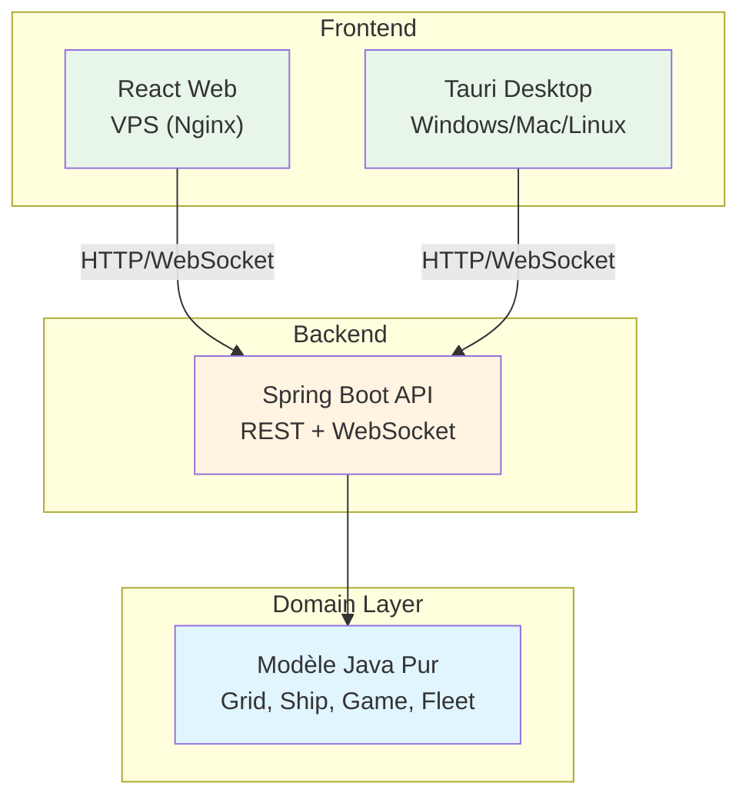
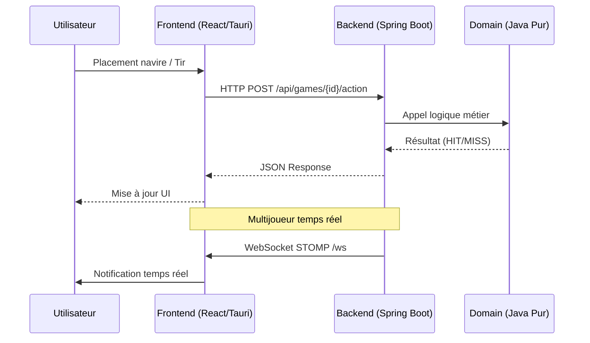
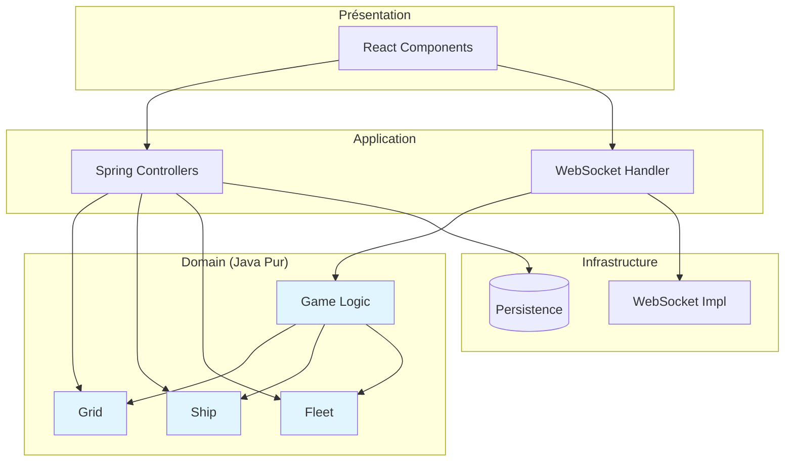
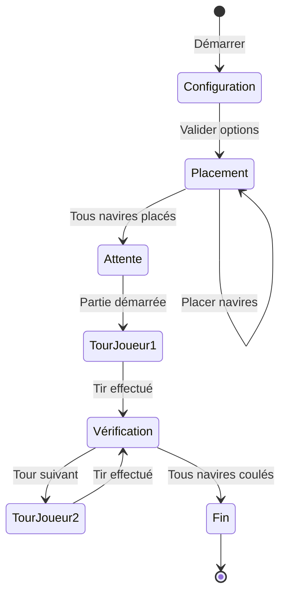
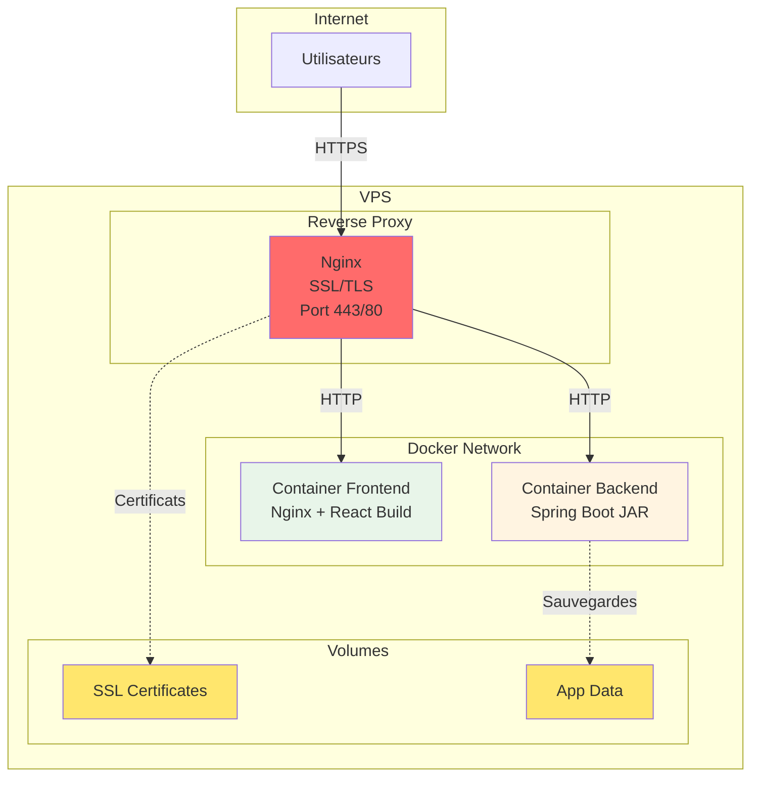

# 🚢 Bataille Navale - Monorepo Moderne

Projet de Bataille Navale respectant les règles classiques : placement de navires, tirs tour par tour, multijoueur temps réel.

**Architecture MVC stricte** : Modèle Java pur, Backend Spring Boot, Frontend React, Client Desktop Tauri.

## 📋 Vue d'ensemble

### Architecture globale



### Flux de données



## 🎯 Fonctionnalités

### Principales (requises)

- ✅ Respect des règles du jeu classique
- ✅ Interface contrôlable intégralement à la souris
- ✅ Écran de sélection des options :
  - Choix du nombre et type de navires
  - Choix de la taille de la grille
  - Mode solo (IA) / multijoueur tour par tour
- ✅ Sauvegarde/chargement de partie

### Avancées (bonus)

- 🌐 Multijoueur temps réel (WebSocket)
- ☁️ Hébergement VPS sécurisé (Docker, reverse proxy, SSL)
- 💻 Client desktop natif (Tauri)
- 🎮 Modes alternatifs : Radar, Artillerie

## 🗂️ Structure du projet

```
battleship-monorepo/
├── README.md
├── backend/                    # Java Spring Boot (MVC)
│   ├── domain/                 # MODÈLE JAVA PUR
│   │   ├── model/
│   │   │   ├── Grid.java
│   │   │   ├── Ship.java
│   │   │   ├── Fleet.java
│   │   │   └── Game.java
│   │   └── ports/              # Interfaces hexagonal
│   ├── application/            # Services métier
│   ├── infrastructure/         # WebSocket, persistence
│   ├── pom.xml
│   └── target/battleship.jar
├── frontend/                   # React (web + Tauri)
│   ├── src/
│   │   ├── components/
│   │   │   └── Grid.tsx
│   │   ├── hooks/
│   │   │   └── useWebSocket.ts
│   │   └── App.tsx
│   ├── package.json
│   └── vite.config.ts
├── tauri/                      # Client desktop
│   ├── src-tauri/
│   │   ├── Cargo.toml
│   │   ├── src/lib.rs         # Lance JAR Java
│   │   └── tauri.conf.json
│   └── src/                   # → Symlink frontend/
├── docker-compose.yml         # Dev/prod
├── Dockerfile                 # Image backend
├── Dockerfile.frontend        # Image frontend (nginx)
├── nginx.conf                 # Configuration reverse proxy
└── deploy/                    # Scripts déploiement VPS
```

## 🏗️ Architecture technique

### Séparation des couches



### Règles du jeu

**Configuration standard :**
- Grille : 10x10 (configurable)
- Navires :
  - 1 Porte-avions (5 cases)
  - 2 Croiseurs (4 cases)
  - 3 Destroyers (3 cases)
  - 4 Sous-marins (2 cases)

**Flux de jeu :**



## 🚀 Installation & Lancement

### Prérequis

- Java 17+ (Maven)
- Node.js 18+
- Rust (pour Tauri) : `curl --proto '=https' --tlsv1.2 -sSf https://sh.rustup.rs | sh`
- Docker & Docker Compose (pour déploiement VPS)

### Développement local

```bash
# Backend Java
cd backend && mvn clean install
java -jar target/battleship.jar  # Port 8080

# Frontend web (nouvel terminal)
cd frontend && npm i && npm run dev  # http://localhost:3000

# Client Tauri (desktop)
cd tauri && npm i && npm run tauri dev
```

### Build production

```bash
# Backend JAR
mvn clean package -Pprod

# Frontend web
npm run build:web  # dist/ pour hébergement

# Desktop (tous OS)
npm run tauri build  # Bundle avec JAR embarqué
```

## ☁️ Déploiement VPS

### Architecture sécurisée avec Docker

Le projet est déployé sur un VPS avec une architecture Docker sécurisée :

- **Backend** : Container Spring Boot isolé
- **Frontend** : Container Nginx servant les fichiers statiques React
- **Reverse Proxy** : Nginx avec SSL/TLS (Let's Encrypt)
- **Sécurité** : Firewall, isolation réseau, variables d'environnement

### Architecture de déploiement



### Préparation du déploiement

#### 1. Build des images

```bash
# Backend
cd backend
mvn clean package -DskipTests
docker build -t battleship-backend:latest -f ../Dockerfile .

# Frontend
cd frontend
npm run build
docker build -t battleship-frontend:latest -f ../Dockerfile.frontend .
```

#### 2. Configuration VPS

```bash
# Sur le VPS
git clone <repo>
cd battleship-monorepo

# Configuration des variables d'environnement
cp .env.example .env
# Éditer .env avec vos configurations
```

#### 3. Déploiement avec Docker Compose

```bash
# Démarrage des services
docker-compose up -d

# Vérification des logs
docker-compose logs -f

# Arrêt
docker-compose down
```

### Sécurisation

#### Firewall (UFW)

```bash
# Sur le VPS
sudo ufw allow 22/tcp    # SSH
sudo ufw allow 80/tcp    # HTTP (redirection vers HTTPS)
sudo ufw allow 443/tcp   # HTTPS
sudo ufw enable
```

#### SSL/TLS avec Let's Encrypt

```bash
# Installation Certbot
sudo apt install certbot python3-certbot-nginx

# Génération certificat
sudo certbot --nginx -d votre-domaine.com

# Renouvellement automatique
sudo certbot renew --dry-run
```

#### Configuration Nginx (reverse proxy)

Le fichier `nginx.conf` configure :
- Redirection HTTP → HTTPS
- Proxy vers backend (port 8080)
- Servir frontend statique
- Headers de sécurité (CORS, CSP, etc.)

### Variables d'environnement

Créer un fichier `.env` à la racine :

```bash
# Backend
SPRING_PROFILES_ACTIVE=prod
SERVER_PORT=8080
DATABASE_URL=jdbc:h2:file:/app/data/battleship
JWT_SECRET=votre-secret-jwt

# Frontend
VITE_API_URL=https://votre-domaine.com/api

# Docker
COMPOSE_PROJECT_NAME=battleship
```

### Monitoring et maintenance

```bash
# Vérifier l'état des containers
docker-compose ps

# Redémarrer un service
docker-compose restart backend

# Mettre à jour l'application
git pull
docker-compose up -d --build

# Sauvegardes
docker-compose exec backend tar -czf /app/data/backup-$(date +%Y%m%d).tar.gz /app/data
```

## 📚 Implémentation progressive

1. **Phase 1** : Modèle Java pur (tests unitaires JUnit)
2. **Phase 2** : Backend Spring Boot (REST + WebSocket)
3. **Phase 3** : Frontend React (grille cliquable)
4. **Phase 4** : Tauri Desktop (JAR embarqué)
5. **Phase 5** : Polish (sauvegarde, modes alternatifs)

## 🤝 Contribution

1. Fork → Branch `feature/nom`
2. `mvn test && npm test`
3. PR avec tests

## 📄 Licence

MIT

---

**Projet réalisé dans le cadre d'études à l'Université Paris-Saclay**
