# 🎯 Modèle Java Pur - Architecture Détaillée

Ce document décrit l'architecture complète du **modèle Java pur** de la Bataille Navale. Le modèle est **100% indépendant** de toute infrastructure (Spring, HTTP, WebSocket) et peut être utilisé directement via console pour le debugging.

## 📋 Table des matières

1. [Vue d'ensemble](#vue-densemble)
2. [Architecture du modèle](#architecture-du-modèle)
3. [Classes principales](#classes-principales)
4. [Diagrammes de classes](#diagrammes-de-classes)
5. [Flux de jeu](#flux-de-jeu)
6. [Utilisation console](#utilisation-console)
7. [Exemples de code](#exemples-de-code)

## 🎯 Vue d'ensemble

### Principe fondamental

Le modèle Java pur contient **toute la logique métier** du jeu de Bataille Navale. Il est conçu pour être :
- ✅ **Indépendant** : Aucune dépendance à Spring, HTTP, WebSocket
- ✅ **Testable** : Utilisable directement via console pour debugging
- ✅ **Réutilisable** : Peut être utilisé par Spring Boot, Tauri, ou tout autre framework
- ✅ **Complet** : Gère toutes les règles du jeu

### Architecture en couches

```mermaid
graph TB
    subgraph Model["Modèle Java Pur"]
        subgraph Core["Core Domain"]
            C["Coordinate"]
            CS["CellStatus"]
            SO["ShipOrientation"]
        end
        
        subgraph Entities["Entités"]
            S["Ship"]
            G["Grid"]
            F["Fleet"]
            P["Player"]
        end
        
        subgraph Game["Game Logic"]
            GM["Game"]
            GS["GameState"]
            GT["GameTurn"]
        end
        
        subgraph Services["Services Métier"]
            PS["PlacementService"]
            SS["ShootingService"]
            VS["ValidationService"]
        end
    end
    
    Core --> Entities
    Entities --> Game
    Game --> Services
    
    style Core fill:#e1f5ff
    style Entities fill:#e8f5e9
    style Game fill:#fff4e1
    style Services fill:#ffe66d
```

## 🏗️ Architecture du modèle

### Structure des packages

```
backend/domain/model/
├── core/
│   ├── Coordinate.java          # Position (x, y)
│   ├── CellStatus.java          # État d'une cellule (EMPTY, SHIP, HIT, MISS, SUNK)
│   └── ShipOrientation.java     # Orientation (HORIZONTAL, VERTICAL)
├── entities/
│   ├── Ship.java                # Navire avec taille, position, orientation
│   ├── Grid.java                # Grille de jeu (10x10 par défaut)
│   ├── Fleet.java               # Flotte de navires d'un joueur
│   └── Player.java              # Joueur (nom, flotte, grille)
└── game/
    ├── Game.java                # Partie complète (2 joueurs, état, tours)
    ├── GameState.java           # État de la partie (CONFIG, PLACEMENT, PLAYING, FINISHED)
    ├── GameTurn.java            # Tour de jeu (joueur actif)
    └── GameResult.java          # Résultat d'une action (HIT, MISS, SUNK, INVALID)
```

### Diagramme de dépendances

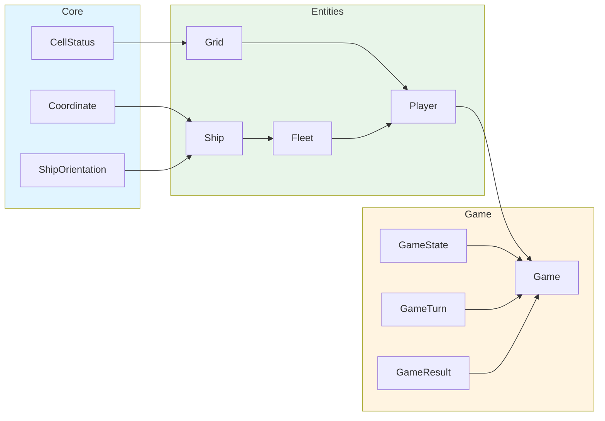

## 📦 Classes principales

### 1. Coordinate (Core)

Représente une position sur la grille.

```java
public class Coordinate {
    private final int x;  // 0-9 (ou selon taille grille)
    private final int y;  // 0-9 (ou selon taille grille)
    
    // Constructeurs, getters, equals, hashCode
    public boolean isValid(int gridSize);
    public Coordinate add(int dx, int dy);
}
```

**Diagramme de classe :**

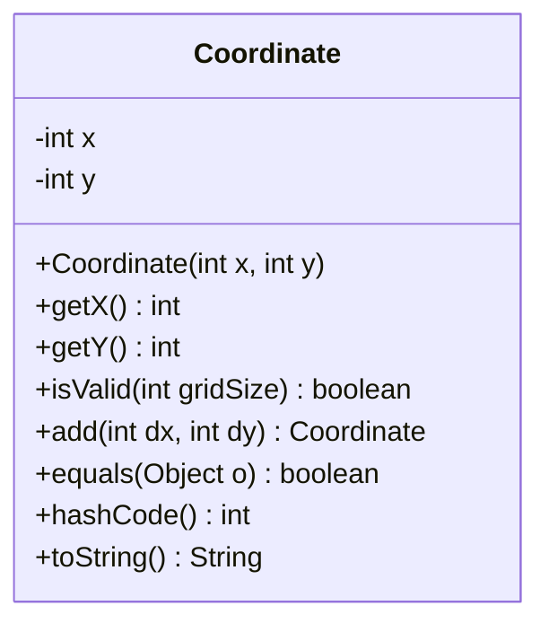

### 2. CellStatus (Core)

Énumération des états possibles d'une cellule.

```java
public enum CellStatus {
    EMPTY,    // Case vide
    SHIP,     // Case occupée par un navire (non touchée)
    HIT,      // Case touchée (navire)
    MISS,     // Case touchée (vide)
    SUNK      // Case d'un navire coulé
}
```

### 3. ShipOrientation (Core)

Orientation d'un navire.

```java
public enum ShipOrientation {
    HORIZONTAL,  // Navire placé horizontalement
    VERTICAL     // Navire placé verticalement
}
```

### 4. Ship (Entity)

Représente un navire avec sa taille, position et orientation.

```java
public class Ship {
    private final String name;           // "Porte-avions", "Croiseur", etc.
    private final int size;              // Taille en cases (2-5)
    private Coordinate startPosition;    // Position de départ
    private ShipOrientation orientation; // Orientation
    private Set<Coordinate> hits;        // Cases touchées
    
    // Méthodes principales
    public boolean isSunk();
    public Set<Coordinate> getOccupiedCells();
    public boolean contains(Coordinate coord);
    public boolean hit(Coordinate coord);
}
```

**Diagramme de classe :**

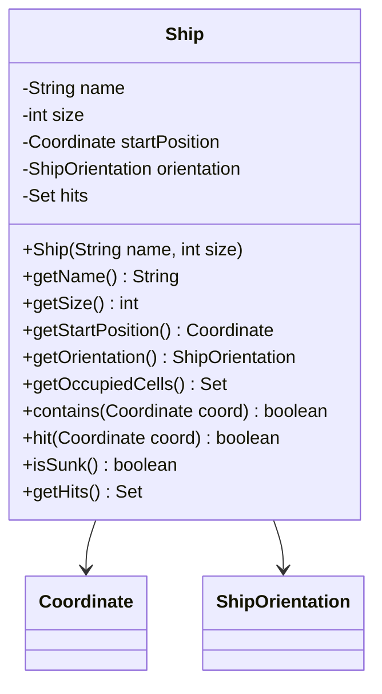

### 5. Grid (Entity)

Grille de jeu d'un joueur (placement des navires et tirs adverses).

```java
public class Grid {
    private final int size;                    // Taille de la grille (10 par défaut)
    private CellStatus[][] cells;              // État de chaque cellule
    private Map<Coordinate, Ship> shipMap;     // Carte navire par position
    
    // Méthodes principales
    public boolean placeShip(Ship ship, Coordinate start, ShipOrientation orientation);
    public CellStatus shoot(Coordinate coord);
    public boolean isValidPlacement(Ship ship, Coordinate start, ShipOrientation orientation);
    public boolean allShipsSunk();
    public GridView getView(boolean revealShips); // Pour affichage console
}
```

**Diagramme de classe :**

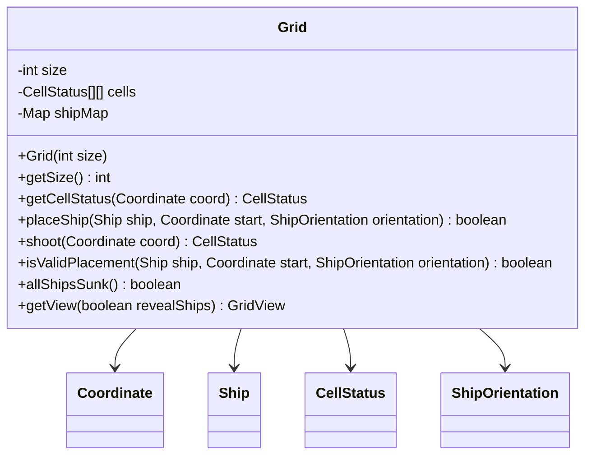

### 6. Fleet (Entity)

Flotte complète d'un joueur (ensemble de navires).

```java
public class Fleet {
    private final List<Ship> ships;           // Liste des navires
    private final Map<String, Integer> shipConfig; // Configuration (nom -> quantité)
    
    // Méthodes principales
    public boolean addShip(Ship ship);
    public boolean isComplete();
    public List<Ship> getShips();
    public List<Ship> getSunkShips();
    public List<Ship> getActiveShips();
}
```

**Diagramme de classe :**

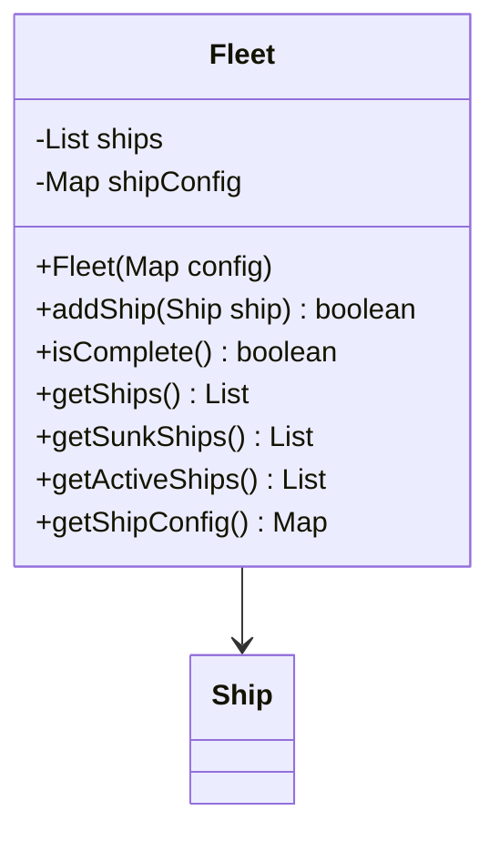

### 7. Player (Entity)

Joueur avec sa flotte et sa grille.

```java
public class Player {
    private final String name;
    private final Fleet fleet;
    private final Grid grid;
    
    // Méthodes principales
    public boolean placeShip(String shipName, Coordinate start, ShipOrientation orientation);
    public CellStatus shootAt(Coordinate coord);
    public boolean hasPlacedAllShips();
    public boolean hasLost();
}
```

**Diagramme de classe :**

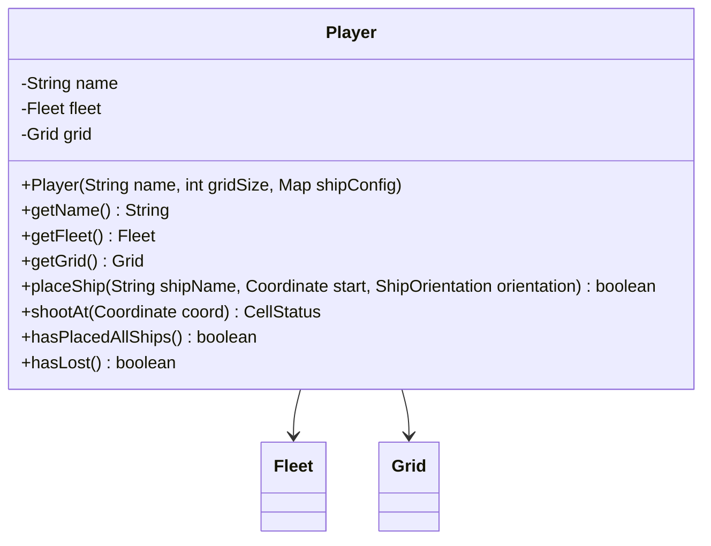

### 8. GameState (Game)

États possibles de la partie.

```java
public enum GameState {
    CONFIG,      // Configuration (taille grille, navires)
    PLACEMENT,   // Placement des navires par les joueurs
    PLAYING,     // Partie en cours (tirs)
    FINISHED     // Partie terminée
}
```

### 9. GameTurn (Game)

Gestion des tours de jeu.

```java
public enum GameTurn {
    PLAYER1,     // Tour du joueur 1
    PLAYER2      // Tour du joueur 2
}
```

### 10. GameResult (Game)

Résultat d'une action (tir, placement).

```java
public class GameResult {
    private final boolean success;
    private final String message;
    private final CellStatus cellStatus;  // Pour les tirs
    private final Ship sunkShip;         // Si un navire est coulé
    
    // Constructeurs statiques
    public static GameResult success(String message);
    public static GameResult error(String message);
    public static GameResult hit(Ship ship);
    public static GameResult miss();
    public static GameResult sunk(Ship ship);
}
```

### 11. Game (Game)

Classe principale gérant toute la logique de la partie.

```java
public class Game {
    private final Player player1;
    private final Player player2;
    private GameState state;
    private GameTurn currentTurn;
    private Player winner;
    
    // Méthodes principales
    public GameResult placeShip(String playerName, String shipName, 
                                Coordinate start, ShipOrientation orientation);
    public GameResult shoot(String playerName, Coordinate target);
    public boolean canStart();
    public void start();
    public boolean isFinished();
    public Player getWinner();
    public GameView getView(String playerName); // Pour affichage console
}
```

**Diagramme de classe complet :**

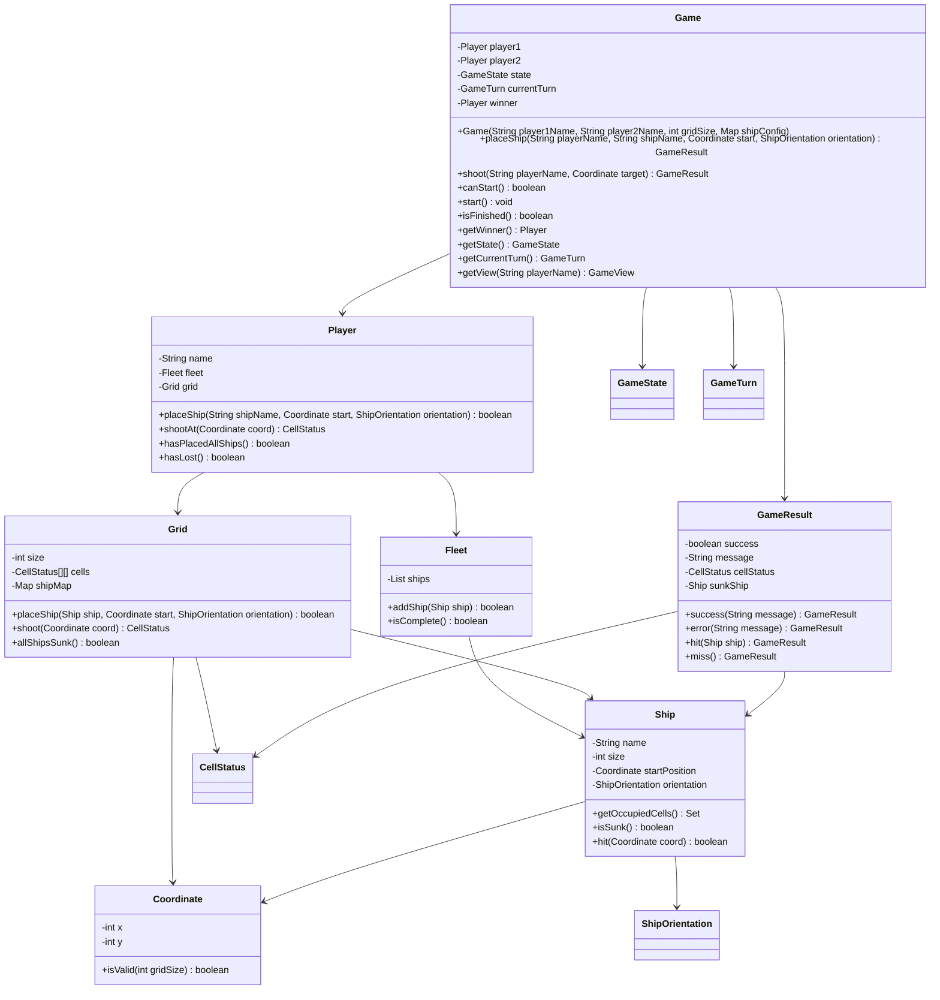

## 🔄 Flux de jeu

### Diagramme de séquence - Placement d'un navire

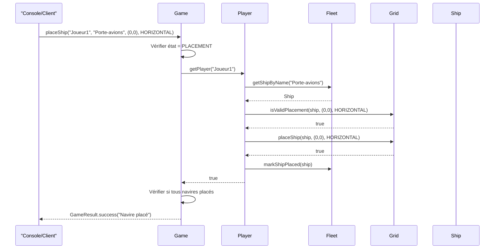

### Diagramme de séquence - Tir

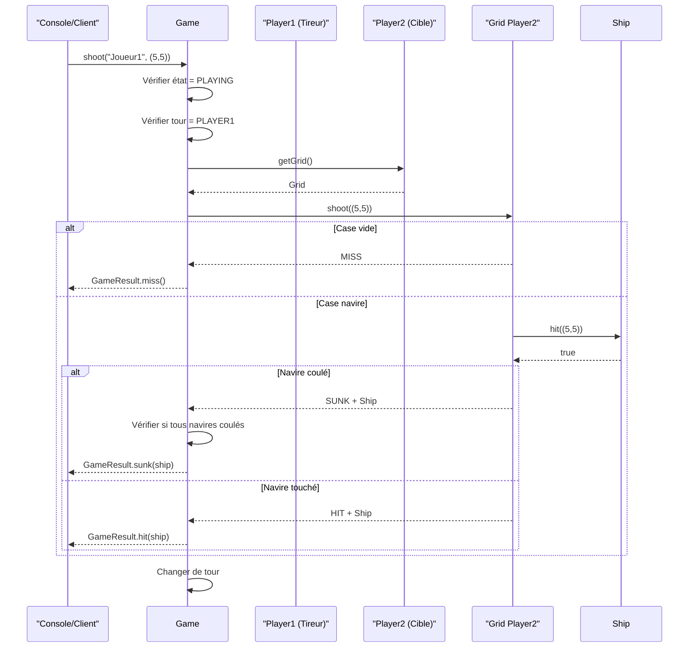

### Machine à états du jeu

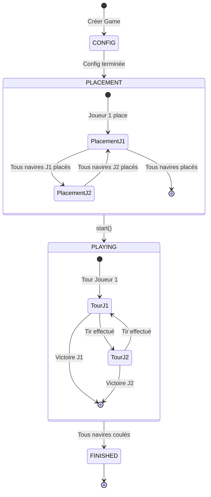

## 🖥️ Utilisation console

### Interface console pour debugging

Le modèle peut être utilisé directement via console pour tester la logique sans interface graphique.

### Exemple d'utilisation

```java
// Création d'une partie
Map<String, Integer> shipConfig = new HashMap<>();
shipConfig.put("Porte-avions", 1);  // 5 cases
shipConfig.put("Croiseur", 2);      // 4 cases
shipConfig.put("Destroyer", 3);     // 3 cases
shipConfig.put("Sous-marin", 4);    // 2 cases

Game game = new Game("Joueur1", "Joueur2", 10, shipConfig);

// Placement des navires - Joueur 1
game.placeShip("Joueur1", "Porte-avions", new Coordinate(0, 0), ShipOrientation.HORIZONTAL);
game.placeShip("Joueur1", "Croiseur", new Coordinate(0, 2), ShipOrientation.HORIZONTAL);
// ... autres navires

// Placement des navires - Joueur 2
game.placeShip("Joueur2", "Porte-avions", new Coordinate(5, 5), ShipOrientation.VERTICAL);
// ... autres navires

// Démarrer la partie
if (game.canStart()) {
    game.start();
}

// Jouer
GameResult result = game.shoot("Joueur1", new Coordinate(5, 5));
System.out.println(result.getMessage()); // "TOUCHÉ ! Porte-avions"

// Afficher l'état
GameView view = game.getView("Joueur1");
view.printToConsole();
```

### Classe ConsoleGame (Helper)

Pour faciliter l'utilisation en console, une classe helper peut être créée :

```java
public class ConsoleGame {
    private final Game game;
    private final Scanner scanner;
    
    public ConsoleGame(String player1Name, String player2Name) {
        // Initialisation avec configuration par défaut
        Map<String, Integer> config = getDefaultShipConfig();
        this.game = new Game(player1Name, player2Name, 10, config);
        this.scanner = new Scanner(System.in);
    }
    
    public void run() {
        // Phase de placement
        placementPhase();
        
        // Phase de jeu
        playingPhase();
    }
    
    private void placementPhase() {
        // Logique de placement interactif
    }
    
    private void playingPhase() {
        // Logique de jeu interactif
    }
    
    public void displayGrid(String playerName) {
        GameView view = game.getView(playerName);
        view.printToConsole();
    }
}
```

### Diagramme d'interaction console

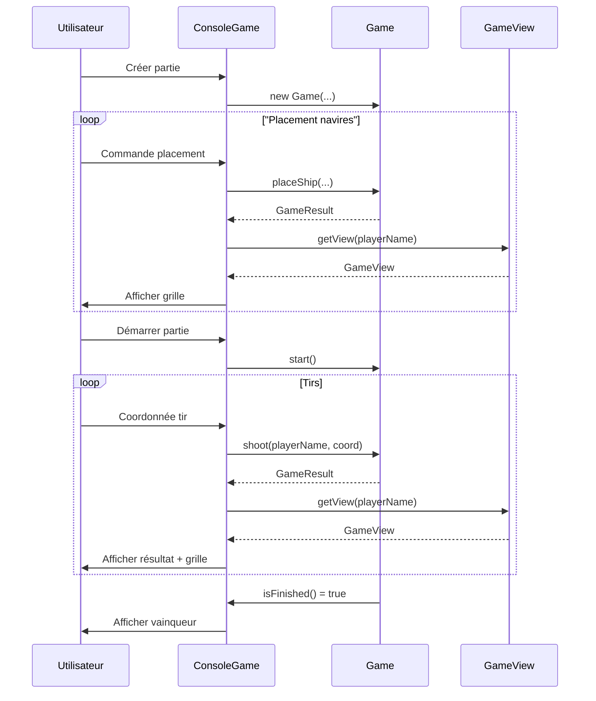

## 💻 Exemples de code

### Exemple 1 : Création et configuration

```java
// Configuration des navires
Map<String, Integer> shipConfig = new HashMap<>();
shipConfig.put("Porte-avions", 1);   // 1 navire de 5 cases
shipConfig.put("Croiseur", 2);       // 2 navires de 4 cases
shipConfig.put("Destroyer", 3);      // 3 navires de 3 cases
shipConfig.put("Sous-marin", 4);     // 4 navires de 2 cases

// Création de la partie
Game game = new Game("Alice", "Bob", 10, shipConfig);
```

### Exemple 2 : Placement d'un navire

```java
// Placement horizontal d'un porte-avions à la position (0, 0)
GameResult result = game.placeShip(
    "Alice",
    "Porte-avions",
    new Coordinate(0, 0),
    ShipOrientation.HORIZONTAL
);

if (result.isSuccess()) {
    System.out.println("Navire placé avec succès !");
} else {
    System.out.println("Erreur : " + result.getMessage());
}
```

### Exemple 3 : Tir sur une case

```java
// Tir du joueur actif sur la case (5, 5)
GameResult result = game.shoot("Alice", new Coordinate(5, 5));

switch (result.getCellStatus()) {
    case HIT:
        System.out.println("TOUCHÉ ! " + result.getSunkShip().getName());
        break;
    case MISS:
        System.out.println("À l'eau !");
        break;
    case SUNK:
        System.out.println("COULÉ ! " + result.getSunkShip().getName());
        break;
}
```

### Exemple 4 : Affichage de la grille

```java
// Obtenir la vue de la grille pour un joueur
GameView view = game.getView("Alice");

// Afficher sa propre grille (avec navires)
view.printOwnGrid();

// Afficher la grille adverse (sans navires, seulement tirs)
view.printOpponentGrid();
```

### Exemple 5 : Vérification de l'état

```java
// Vérifier si la partie peut démarrer
if (game.canStart()) {
    game.start();
    System.out.println("Partie démarrée !");
}

// Vérifier si la partie est terminée
if (game.isFinished()) {
    Player winner = game.getWinner();
    System.out.println("Vainqueur : " + winner.getName());
}
```

## 🧪 Tests unitaires

Le modèle doit être testé avec JUnit pour garantir la validité de la logique métier.

### Exemple de test

```java
@Test
public void testPlaceShip() {
    Game game = new Game("J1", "J2", 10, getDefaultConfig());
    
    GameResult result = game.placeShip(
        "J1", "Porte-avions", 
        new Coordinate(0, 0), 
        ShipOrientation.HORIZONTAL
    );
    
    assertTrue(result.isSuccess());
    assertFalse(game.canStart()); // Pas encore tous placés
}

@Test
public void testShoot() {
    Game game = setupGameWithShips();
    game.start();
    
    GameResult result = game.shoot("J1", new Coordinate(0, 0));
    
    assertEquals(CellStatus.HIT, result.getCellStatus());
}
```

## 📝 Résumé

Le modèle Java pur est **autonome** et contient toute la logique métier :

- ✅ **Core** : Types de base (Coordinate, CellStatus, ShipOrientation)
- ✅ **Entities** : Entités métier (Ship, Grid, Fleet, Player)
- ✅ **Game** : Logique de partie (Game, GameState, GameTurn, GameResult)
- ✅ **Console** : Utilisable directement pour debugging
- ✅ **Tests** : Testable unitairement sans dépendances externes

Ce modèle peut ensuite être utilisé par :
- Spring Boot (via services/controllers)
- Tauri (via JAR embarqué)
- Tests unitaires
- Console de debugging

---

**Note** : Ce modèle est la **Phase 1** du projet. Il doit être complètement fonctionnel et testé avant d'ajouter Spring Boot (Phase 2).

